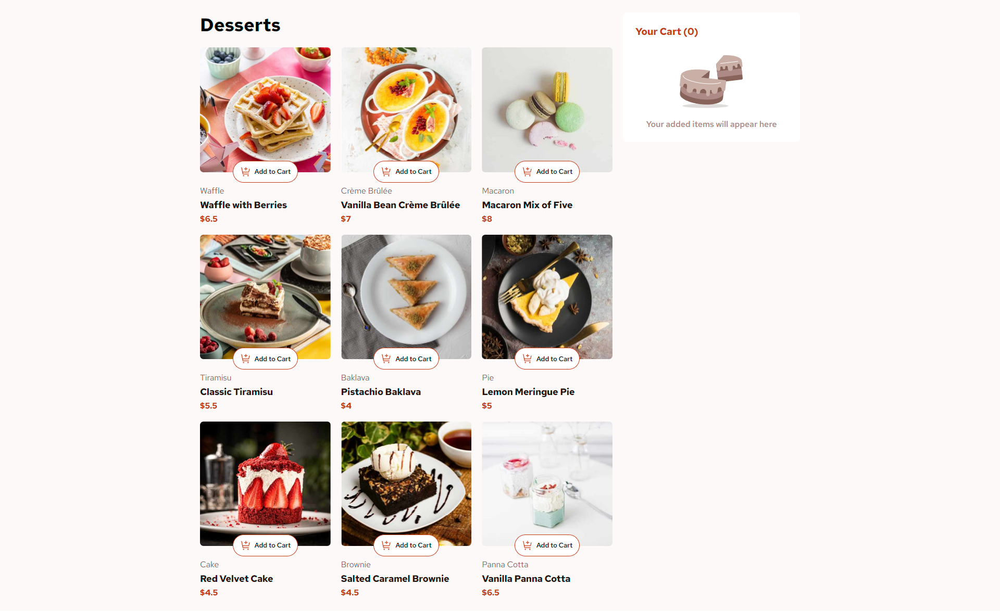

# Frontend Mentor - Product list with cart solution

This is a solution to the [Product list with cart challenge on Frontend Mentor](https://www.frontendmentor.io/challenges/product-list-with-cart-5MmqLVAp_d). Frontend Mentor challenges help you improve your coding skills by building realistic projects.

## Table of contents

- [The challenge](#the-challenge)
- [Screenshot](#screenshot)
- [Links](#links)
  - [Built with](#built-with)
  - [What I learned](#what-i-learned)
  - [Useful resources](#useful-resources)
- [Author](#author)

### The challenge

Users should be able to:

- Add items to the cart and remove them
- Increase/decrease the number of items in the cart
- See an order confirmation modal when they click "Confirm Order"
- Reset their selections when they click "Start New Order"
- View the optimal layout for the interface depending on their device's screen size
- See hover and focus states for all interactive elements on the page

### Screenshot

### Links

- Solution URL: [Solution](https://github.com/SaeneArmaan/product-list-with-cart-main)
- Live Site URL: [Add live site URL here](https://your-live-site-url.com)

### Built with

- Semantic HTML5 markup
- CSS custom properties
- Flexbox
- Mobile-first workflow
- [React](https://reactjs.org/) - JS library

### What I learned

I've recently learned how to use React and its powerful features like hooks, including useState for managing state and useEffect for handling side effects in functional components. I also explored parent-to-child component relationships, which allow efficient data flow and component interaction in React applications.

### Useful resources

- [Mdn Docs](https://developer.mozilla.org/en-US/) - This helps me when i am stuck with css concepts or javascript

## Author

- Frontend Mentor - [@SaeneArmaan](https://www.frontendmentor.io/profile/SaeneArmaan)
- Twitter - [@Armaan2Saini](https://x.com/Armaan2Saini)
